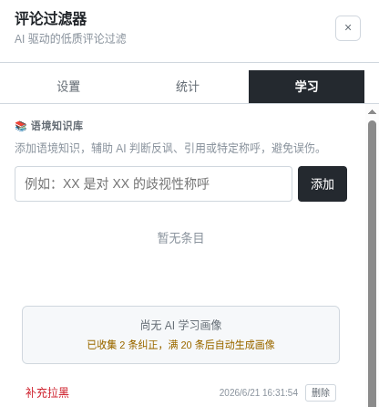

<p align="center">
  
  
</p>

<h1 align="center">Info Cocoon Amplifier</h1>

<p align="center">
  <sub>AI 驱动的 B 站评论过滤器 · Tampermonkey 脚本 · DeepSeek 智能判定</sub>
</p>


## 这是什么

一个帮你过滤 B 站评论区的浏览器脚本。

接 DeepSeek API，AI 逐条判定评论是否违规。违规的折叠起来——想看的点开，不想看的就当不存在。

附带一套本地黑名单、缓存加速、AI 自我学习，用久了它会越来越懂你的偏好。

## 能做什么


**AI 判定 & 折叠**

- DeepSeek 批量判定，带视频上下文，最多 20 条/批
- 四种折叠风格任选：经典黄底 · 极简灰线 · 弱化淡出 · 直接移除

**让它学你的口味**

- 每次「取消拉黑」「误判展开」「手动拉黑」自动记录
- 攒够 20 条，AI 生成一份过滤画像，注入每次判定
- 画像可随时编辑或一键重新生成
- 手动添加语境知识（反讽、特定称呼），辅助 AI 理解上下文

**本地数据管理**

- IndexedDB 黑名单，以 B 站 UID 为键
- block / high 级别自动拉黑，也支持评论旁一键手动拉黑
- LRU 缓存 24h 过期，避免重复调 API
- 统计面板：扫描量、过滤量、Token 消耗、费用估算、严重度分布

**按你的习惯来**

- Prompt 完全自定义
- 独立控制是否附带用户名、用户 ID、视频简介，节省 Token
- 自定义 Token 单价
- 三种 UI 主题 + 全局字体缩放





## 安装

```bash
git clone <repo-url>
cd ruozhi-filter
npm install
npm run build
```

`dist/ruozhi-filter.user.js` 拖进 Tampermonkey / Violentmonkey。


## 使用

1. 打开 B 站视频
2. 点右下角悬浮按钮
3. 填 API Key，调一下 Prompt 和折叠风格
4. 保存，滚到评论区即可

## 技术栈

TypeScript · Vite · vite-plugin-monkey · IndexedDB (idb) · DeepSeek API


## 贡献者

感谢以下开发者对本项目的支持与贡献！：

<a href="https://github.com/YifanHere">
  
</a>

## License

MIT
