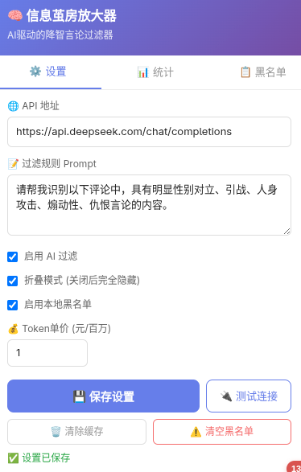
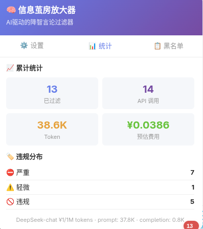

<p align="center">
  
  
  
  
</p>

<h1 align="center">🧠 信息茧房放大器</h1>
<h3 align="center"><i>Info Cocoon Amplifier — 看不见就不存在。</i></h3>

<p align="center">
  <sub>AI 驱动的 B 站降智评论过滤器 · Tampermonkey 脚本 · DeepSeek 提供智能判定</sub>
</p>

---

## 💬 作者的话

你是否厌倦了大数据总给你推送那些争议性极大、让你迅速上火的视频？是否懒得在评论区跟满嘴喷粪的人争论半句？

开启这个插件，把评论区变成你的私人信息茧房——看不见，就不存在。

> 本插件仅图一乐，切莫认真。**我即算法，我即茧房。**
>
> 遵循 MIT 开源协议，欢迎 fork 修改。

---

## ✨ 特性

| 功能 | 说明 |
|------|------|
| 🔍 纯 DOM 扫描 | 遍历评论区 Shadow DOM，不做网络拦截，不依赖 B 站 API |
| 🤖 AI 判定 | DeepSeek API 批量判定，带视频标题/简介上下文 |
| 🚫 手动拉黑 | 每条评论自带拉黑按钮，一键屏蔽讨厌的用户 |
| 📋 本地黑名单 | IndexedDB 持久化，block / high 级别自动拉黑 + 手动拉黑，以用户名 hash 为 key |
| 🔄 智能缓存 | LRU 缓存 24h 过期，避免重复 API 调用 |
| 👁️ 折叠模式 | 违规评论折叠显示，点开可查看 AI 判定原因（支持开关） |
| 📊 统计面板 | Token 消耗、预估费用、违规严重度分布 |
| ⚙️ 自定义 Prompt | 自由编写过滤规则，支持/反对立场可直接写进 Prompt |
| 💰 自定义计费 | 支持任意模型的价格设定 |
| 🛡️ 滚动拦截 | MutationObserver + scroll 双重监听，翻页/加载更多不漏 |

---

## 📸 截图

### 设置面板 & 统计



### 黑名单管理



---

## 📦 安装

```bash
git clone <repo-url>
cd ruozhi-filter
npm install
npm run build
```

将 `dist/ruozhi-filter.user.js` 拖入 Tampermonkey / Violentmonkey 即可。

---

## 🚀 使用

1. 打开任意 B 站视频页面
2. 点击右下角 🧠 悬浮按钮 → 打开设置面板
3. 填入 **DeepSeek API Key**，自定义 Prompt
4. 保存设置，滚动到评论区 → 自动扫描 & 过滤
5. 点击评论旁的 `🚫 拉黑` 按钮可手动屏蔽用户
6. 切换到 **📊 统计** 标签查看 token 消耗
7. 切换到 **📋 黑名单** 标签管理拉黑记录
8. 控制台执行 `__ruozhi_diag()` 查看诊断信息

---

## 📝 Prompt 示例

```
请帮我识别以下评论中，具有明显性别对立、引战、人身攻击、煽动性、仇恨言论性质的内容。
对严重违规的评论标记为 high 或 block 级别。
```

---

## 🛠 技术栈

`TypeScript` · `Vite` · `vite-plugin-monkey` · `IndexedDB (idb)` · `DeepSeek API`

---

## 📄 License

MIT © 2024
